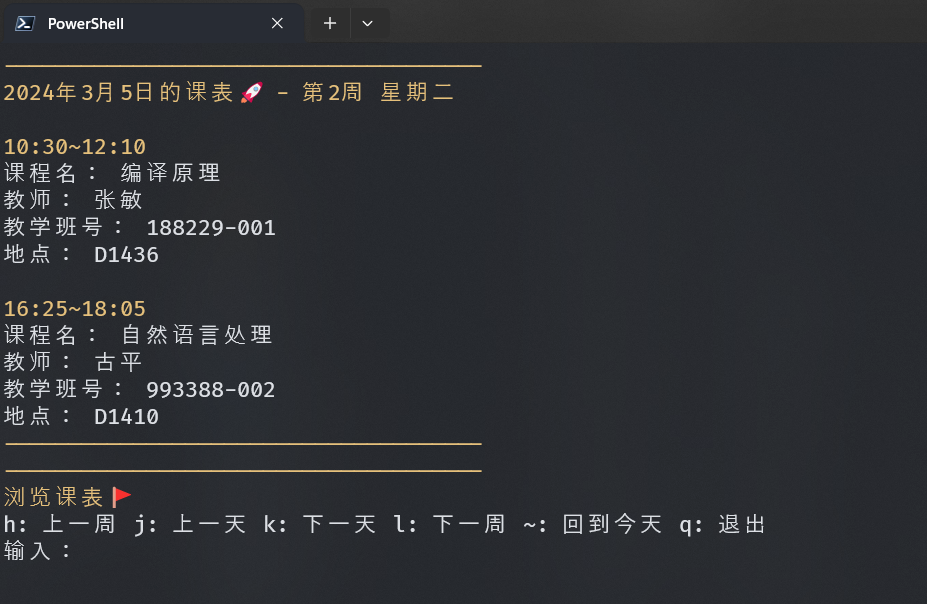
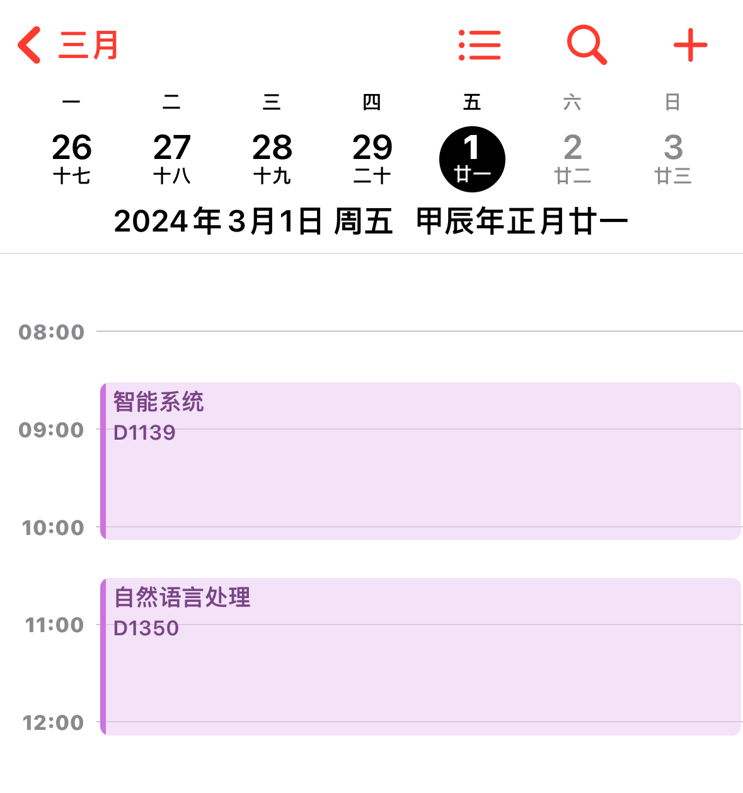

# CQU Timetable

Python实现的命令行查询CQU课表。可以浏览课表和导出ics文件。

## 效果

### 命令行



### 导入日历（以iOS为例）



## 使用方法

1. **选课界面**（链接：[选课管理 - 重庆大学 (cqu.edu.cn)](https://my.cqu.edu.cn/enroll/CourseStuSelectionList)）- **查看课表** - **下载Excel**

2. 将下载的Excel文件放在根目录下。

3. 安装需要的依赖

   ```
   pip install -r requirements.txt
   ```

4. 运行 `main.py`

### 配置文件

配置文件是 `config.ini` ，里面只需修改第2行 `weekone` 的值，它表示当前学期**第一周的周一日期**。请按照“xxxx-xx-xx”的格式输入。你可以在[校历-重庆大学本科教学信息网 (cqu.edu.cn)](http://jwc.cqu.edu.cn/xl.htm)查询具体时间。

### 导入iCloud日历

iCloud日历导入ics文件比较麻烦，所以提供一种简单的导入方法：

1. 在运行后，选择“导出ics文件”，此时会生成2个文件：`CQUTimetable.ics` 和 `url.txt`

2. 将 `url.txt` 这个文件传输至iPhone

3. 在iPhone上拷贝 `url.txt` 里面的所有内容，粘贴到Safari并打开链接。

如果你是其他平台，比如Windows的Outlook，直接双击ics文件导入即可。
